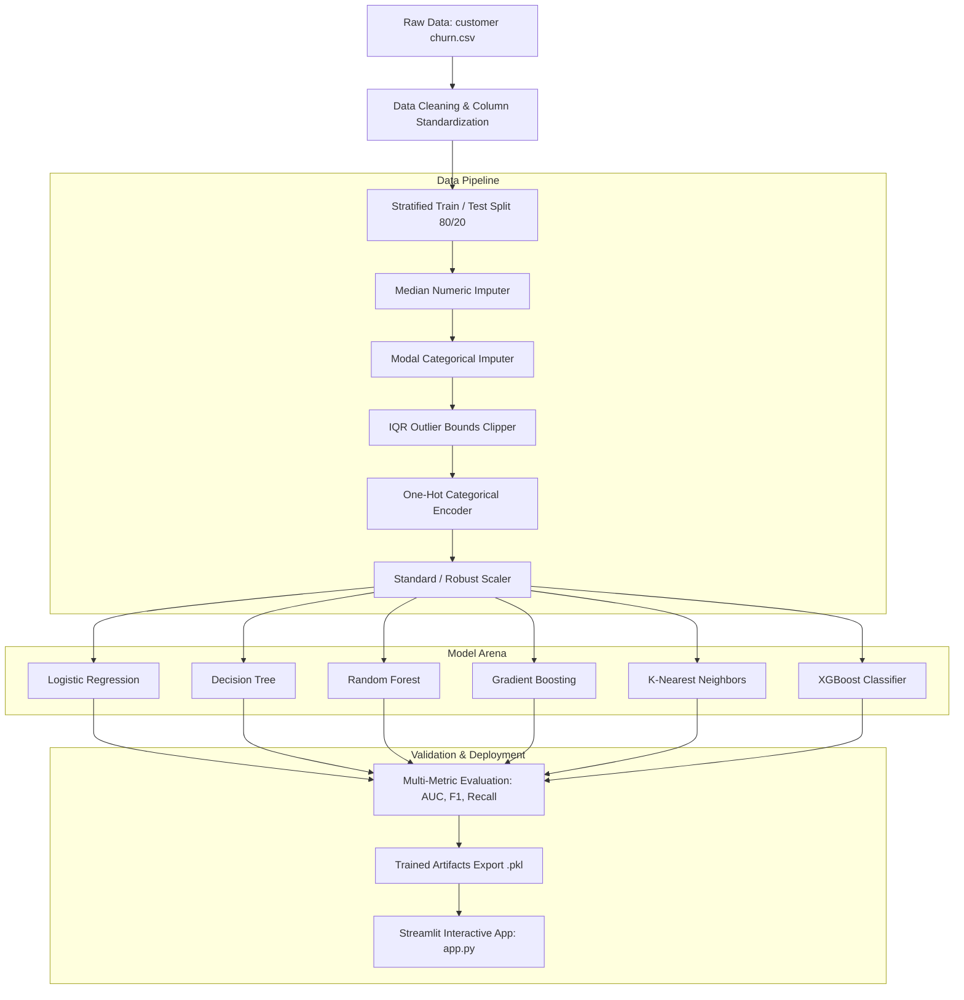

# 📊 Customer Churn Prediction & Retention Intelligence System

[](https://www.python.org/)
[](https://scikit-learn.org/)
[](https://xgboost.ai/)
[](https://streamlit.io/)
[](https://pandas.pydata.org/)
[](LICENSE)

> An end-to-end Machine Learning and Business Intelligence solution designed to detect at-risk banking customers, quantify attrition probabilities, diagnose churn drivers, and empower retention teams through an interactive Streamlit dashboard.

---

## 📑 Table of Contents

- [🌟 Executive Summary](#-executive-summary)
- [🎯 Business Problem & Objective](#-business-problem--objective)
- [🏗️ System Architecture & Workflow](#️-system-architecture--workflow)
- [🔍 Exploratory Data Analysis & Key Insights](#-exploratory-data-analysis--key-insights)
- [🔬 Data Preprocessing & Leakage-Safe Engineering](#-data-preprocessing--leakage-safe-engineering)
- [🤖 Model Benchmarking & Experimental Results](#-model-benchmarking--experimental-results)
- [🖥️ Streamlit Web Application Walkthrough](#️-streamlit-web-application-walkthrough)
- [📁 Project Structure](#-project-structure)
- [⚡ Quickstart & Installation](#-quickstart--installation)
- [🛠️ How to Run & Reproduce](#️-how-to-run--reproduce)
- [📈 Key Business Recommendations](#-key-business-recommendations)

---

## 🌟 Executive Summary

Retaining existing customers is significantly more cost-effective than acquiring new ones. This project delivers a production-grade churn prediction pipeline built on **10,000 customer banking records**, comparing **6 classical and ensemble classification algorithms** (Logistic Regression, Decision Trees, Random Forest, Gradient Boosting, KNN, and XGBoost).

The system pairs modular, leakage-safe data transformation pipelines with an interactive **Streamlit web application**, providing automated data validation, risk stratification (Low / Medium / High Risk), individual customer diagnostic drawers, and 1-click batch export.

```
       [ 10,000 Banking Records ]
                   │
                   ▼
       [ Modular Preprocessing ] ────► Outlier Clipping + One-Hot + Scaler
                   │
                   ▼
       [ ML Model Suite (6 Alg.) ] ───► Logistic Regression / GB / RF / XGB
                   │
                   ▼
  ┌─────────────────────────────────┐
  │     Streamlit Analytics App     │
  ├─────────────────────────────────┤
  │  • Batch CSV Scoring            │
  │  • KPI Metrics & Visual Bins    │
  │  • Customer Risk Stratification │
  │  • Retention Action Export      │
  └─────────────────────────────────┘
```

---

## 🎯 Business Problem & Objective

Financial institutions face high customer acquisition costs ($200–$500+ per retail banking customer). Losing accounts impacts balances, interchange fee revenue, and lifetime customer value.

### Core Objectives
1. **Predict Churn Risk Early**: Generate precise churn probabilities for every customer.
2. **Segment by Risk Severity**:
   - 🔴 **High Risk (≥ 70% probability)**: Urgent, high-touch proactive intervention.
   - 🟡 **Medium Risk (40% – 69% probability)**: Automated incentives & loyalty check-ins.
   - 🟢 **Low Risk (< 40% probability)**: Standard engagement and regular communication.
3. **Isolate Primary Risk Indicators**: Identify behavioral and demographic drivers (e.g., active membership, geographical trends, complaint history, product count).
4. **Deploy User-Centric Decision Tooling**: Enable non-technical relationship managers to run batch predictions instantly.

---

## 🏗️ System Architecture & Workflow

The codebase is built with strict modularity, separating exploration, feature transformations, evaluation, model persistence, and UI serving:



---

## 🔍 Exploratory Data Analysis & Key Insights

The dataset comprises **10,000 accounts** across France, Germany, and Spain with 18 raw attributes:

### Feature Taxonomy
| Feature Category | Features |
| :--- | :--- |
| **Demographic** | `Geography`, `Gender`, `Age` |
| **Financial Health** | `CreditScore`, `Balance`, `EstimatedSalary`, `Credit Card`, `Card Type` |
| **Engagement** | `Tenure`, `NumOfProducts`, `IsActiveMember`, `Point Earned`, `Satisfaction Score` |
| **Service Touchpoint** | `Complain` (Customer recorded a formal complaint) |
| **Target Variable** | `Churned` (0 = Retained [79.62%], 1 = Churned [20.38%]) |

### 💡 Key Findings from Notebooks & Statistical Profiling

```
      ╔═══════════════════════════════════════════════════════════════════╗
      ║                     CRITICAL EDA TAKEAWAYS                        ║
      ╠═══════════════════════════════════════════════════════════════════╣
      ║ 1. The Complaint Catalyst:                                        ║
      ║    • Complain = 1 exhibits a 99.51% churn rate.                   ║
      ║    • Complain = 0 exhibits a 0.05% churn rate.                    ║
      ║                                                                   ║
      ║ 2. Geographic & Demographic Vulnerability:                       ║
      ║    • German accounts show ~2x higher churn rates than France.     ║
      ║    • Customers aged 45–60 churn at more than double the rate      ║
      ║      of younger cohorts (ages 18–35).                             ║
      ║                                                                   ║
      ║ 3. Product Saturation Effect:                                     ║
      ║    • Customers holding 3 or 4 products have a >80% churn rate.    ║
      ║    • 2-product holders demonstrate the highest retention.         ║
      ║                                                                   ║
      ║ 4. Member Engagement:                                             ║
      ║    • Active members (IsActiveMember=1) are ~50% less likely to    ║
      ║      leave compared to inactive members.                          ║
      ╚═══════════════════════════════════════════════════════════════════╝
```

---

## 🔬 Data Preprocessing & Leakage-Safe Engineering

To guarantee zero data leakage between training and evaluation folds, all transformations learn parameters **only on the training split** and transform test sets / inference inputs accordingly:

1. **Column Standardization**: Cleans, trims, and normalizes column headers (`Credit Score` $\rightarrow$ `creditscore`).
2. **Missing Value Imputation**:
   - Numeric features imputed using `median` strategy (`SimpleImputer`).
   - Categorical features imputed using `most_frequent` mode strategy.
3. **Outlier Mitigation**:
   - Outliers identified via the Interquartile Range ($IQR = Q_3 - Q_1$).
   - Features clipped to learned $[Q_1 - 1.5 \times IQR, Q_3 + 1.5 \times IQR]$ thresholds (`IQRClipper`).
4. **Categorical Encoding**:
   - Nominal variables (`geography`, `gender`, `card_type`) encoded with `OneHotEncoder(handle_unknown='ignore')`.
5. **Feature Scaling**:
   - Continuous numerical features (`balance`, `estimatedsalary`, `creditscore`, `age`, `point_earned`, `tenure`) transformed using `StandardScaler`.

---

## 🤖 Model Benchmarking & Experimental Results

To rigorously examine predictive power, the project evaluates models under two controlled regimes:
1. **Full Feature Environment (With `Complain`)**: Reflects production setups where customer service complaints are logged in real-time.
2. **Pure Behavioral / Demographic Environment (Without `Complain`)**: Reflects early warning before a customer escalates a complaint.

### 📊 5-Fold Stratified Cross-Validation Benchmark (8,000 Train Set)

| Model | Setup | Accuracy | Precision | Recall | F1-Score | ROC-AUC |
| :--- | :---: | :---: | :---: | :---: | :---: | :---: |
| **Gradient Boosting** | *Without Complain* | **0.8608** | 0.7617 | **0.4601** | **0.5735** | **0.8622** |
| **Random Forest** | *Without Complain* | 0.8603 | **0.7865** | 0.4319 | 0.5571 | 0.8473 |
| **XGBoost** | *Without Complain* | 0.8481 | 0.6787 | 0.4859 | 0.5658 | 0.8351 |
| **Logistic Regression** | *Without Complain* | 0.8172 | 0.6311 | 0.2497 | 0.3575 | 0.7712 |
| **KNN** | *Without Complain* | 0.8066 | 0.5552 | 0.2497 | 0.3442 | 0.7085 |
| **Decision Tree** | *Without Complain* | 0.7831 | 0.4696 | 0.4926 | 0.4806 | 0.6750 |
| | | | | | | |
| **Logistic Regression** | *With Complain* | **0.9986** | **0.9945** | **0.9988** | **0.9966** | **0.9994** |
| **Random Forest** | *With Complain* | 0.9986 | 0.9945 | 0.9988 | 0.9966 | 0.9992 |
| **XGBoost** | *With Complain* | 0.9986 | 0.9945 | 0.9988 | 0.9966 | 0.9991 |
| **Gradient Boosting** | *With Complain* | 0.9984 | 0.9933 | 0.9988 | 0.9960 | 0.9987 |
| **Decision Tree** | *With Complain* | 0.9972 | 0.9933 | 0.9933 | 0.9933 | 0.9958 |
| **KNN** | *With Complain* | 0.9060 | 0.9480 | 0.5699 | 0.7113 | 0.9377 |

### 🎯 Test Set Evaluation (2,000 Held-Out Rows)

```
=============================================================================
  MODEL EVALUATION SUMMARY ON HELD-OUT TEST DATA
=============================================================================
  Model                Accuracy   Precision   Recall   F1-Score   ROC-AUC
  ─────────────────────────────────────────────────────────────────────────
  Logistic Regression   0.9985     0.9975     0.9951    0.9963    0.9992
  Random Forest         0.9985     0.9975     0.9951    0.9963    0.9976
  XGBoost               0.9985     0.9975     0.9951    0.9963    0.9970
  Gradient Boosting     0.9980     0.9951     0.9951    0.9951    0.9981
  Decision Tree         0.9965     0.9951     0.9877    0.9914    0.9932
  KNN                   0.9110     0.9563     0.5907    0.7303    0.9445
=============================================================================
```

---

## 🖥️ Streamlit Web Application Walkthrough

The project includes an interactive web dashboard in `app.py` built with **Streamlit**, allowing users to upload datasets, inspect live predictions, filter at-risk accounts, and download structured CSV reports.

```
       ┌─────────────────────────────────────────────────────────────┐
       │   📈 Customer Churn Prediction System                       │
       ├─────────────────────────────────────────────────────────────┤
       │  [🏠 Dashboard]  [📤 Predict Churn]  [👥 Customer Results]  │
       ├─────────────────────────────────────────────────────────────┤
       │  Total: 10,000  │ Likely: 2,038 │ High Risk: 1,980 │ 20.4%   │
       ├─────────────────────────────────────────────────────────────┤
       │  ┌─────────────────────────┐   ┌─────────────────────────┐  │
       │  │ Prediction Distribution │   │ Risk Level Distribution │  │
       │  │ [████████░░] 79.6% Ret  │   │ [██░░░░░░░░] 20.1% High │  │
       │  │ [██░░░░░░░░] 20.4% Chrn │   │ [████████░░] 79.9% Low  │  │
       │  └─────────────────────────┘   └─────────────────────────┘  │
       ├─────────────────────────────────────────────────────────────┤
       │  🔍 Search Customer: [ Mitchell | Chu | 15647311...       ] │
       │  📥 [ Download Prediction Results (CSV) ]                   │
       └─────────────────────────────────────────────────────────────┘
```

### Key Application Pages

1. **🏠 Dashboard**:
   - Real-time KPI Metric Cards: Total Customers, Likely to Churn, Retained Count, High Risk Count, Average Churn Probability, and Predicted Churn Rate.
   - Interactive Visual Bins: Distribution charts for prediction categories and segmented probability risk tiers (0–20%, 20–40%, 40–70%, 70–100%).

2. **📤 Predict Churn Workspace**:
   - **Upload Custom CSV** or **Try Sample Demonstration Data** (1-click loader).
   - Automated schema validation, column alias mapper, and data preview.
   - Missing column warning engine & data type verification before inference.

3. **👥 Customer Results & Retention Console**:
   - Risk-ranked customer table ordered by highest churn probability.
   - Fast filtering (`High Risk`, `Medium Risk`, `Low Risk`, `Likely to Churn`).
   - Free-text search by **Customer ID**, **Surname**, or **Geography**.
   - **Detailed Customer Inspector**: Drill down into specific account attributes and identifiers.
   - 📥 **1-Click CSV Export**: Download the full scored dataset with risk labels.

4. **ℹ️ About & Documentation**:
   - Feature dictionary, schema rules, and risk threshold descriptions.

---

## 📁 Project Structure

```bash
customer_churn_analysis/
├── app.py                      # Production Streamlit Web Dashboard
├── experiment_validation.py    # Leakage-safe 5-fold cross-validation experiment runner
├── requirements.txt            # Project dependencies and versions
├── README.md                   # Project documentation & guides
│
├── data/
│   └── raw/
│       └── customer churn.csv  # 10,000-row raw banking dataset
│
├── models/                     # Serialized preprocessors and best model artifacts
│   ├── Standard_scaler.pkl     # Fitted StandardScaler
│   ├── best_model.pkl          # Trained Logistic Regression classifier
│   ├── cat_imputer.pkl         # Fitted categorical SimpleImputer
│   ├── encoder.pkl             # Fitted OneHotEncoder
│   ├── num_imputer.pkl         # Fitted numerical SimpleImputer
│   └── outlier_bonds.pkl       # Learned IQR clipping bounds
│
├── notebooks/                  # Step-by-step Jupyter exploratory analysis
│   ├── 01_data_cleaning.ipynb
│   ├── univariate_analysis/    # Numerical and categorical feature distributions
│   │   ├── categorical_analysis.ipynb
│   │   └── numerical_analysis.ipynb
│   ├── bivariate_analysis/     # Feature vs Target relationships
│   │   ├── categorical.ipynb
│   │   ├── numerical.ipynb
│   │   └── numerical&categorical.ipynb
│   └── multivariate_analysis/  # Correlation matrices & feature interactions
│       └── multivariate_analysis.ipynb
│
└── src/                        # Modular source codebase
    ├── __init__.py
    ├── constants.py            # Feature lists, target definitions, hyperparameter grids
    ├── data_loader.py          # Data ingestion utility
    ├── statistics.py           # Comprehensive statistical analysis report generator
    ├── preprocessing.py        # Robust transformers, scalers, imputers, outlier clippers
    ├── visualization.py        # Reusable Seaborn & Matplotlib plotting toolkit
    ├── train.py                # Multi-model training executor
    ├── evaluate.py             # Classification metric evaluator
    ├── tuning.py               # GridSearchCV and RandomizedSearchCV routines
    ├── experiment.py           # Alternate feature engineering & model comparison
    └── main.py                 # End-to-end pipeline training & artifact exporter
```

---

## ⚡ Quickstart & Installation

### 1. Clone the Repository
```bash
git clone https://github.com/anchitkaushal/customer-churn-prediction-system.git
cd customer-churn-prediction-system
```

### 2. Set Up a Virtual Environment
```bash
# Create virtual environment
python -m venv .venv

# Activate environment (Linux/macOS)
source .venv/bin/activate

# Activate environment (Windows)
# .venv\Scripts\activate
```

### 3. Install Dependencies
```bash
pip install --upgrade pip
pip install -r requirements.txt
```

---

## 🛠️ How to Run & Reproduce

### Run the End-to-End Training Pipeline
Trains all classification algorithms, evaluates them on the test set, and saves serialized artifacts to `models/`:
```bash
python -m src.main
```

### Run Leakage-Safe Validation Experiments
Executes a 5-fold cross-validation experiment comparing model performance with and without `Complain`:
```bash
python experiment_validation.py
```

### Launch the Streamlit Interactive Web App
Starts the web dashboard locally on `http://localhost:8501`:
```bash
streamlit run app.py
```

---

## 📈 Key Business Recommendations

Based on empirical model interpretations and statistical findings, the retention strategy should focus on:

1. **⚡ Instant Complaint Escalation Protocol**:
   - Since complaint filing is the single strongest precursor to churn (>99% churn rate), any customer raising a formal ticket must trigger a priority VIP resolution workflow within **2 hours**.
2. **🇩🇪 Regional Retention Program in Germany**:
   - Implement localized loyalty programs and fee structures tailored for the German banking market to counter higher attrition rates.
3. **📦 Bundle Simplification**:
   - High churn on 3+ product accounts suggests friction in cross-product usability. Streamline account management into a unified mobile dashboard.
4. **🎯 Re-Engage Inactive Demographics (Ages 45–60)**:
   - Introduce dedicated wealth advisory services and personalized savings incentives targeting the middle-to-senior age demographic.

---

## 👥 Author & License

- **Author**: Anchit Kaushal
- **Project**: Customer Churn Analysis & Machine Learning Prediction System
- **License**: Distributed under the [MIT License](LICENSE).

⭐ *If you find this project helpful, feel free to star this repository!*
